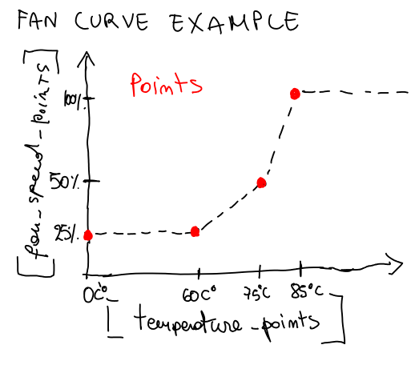

# simple-nvidia-fancontrol

I have made this software because I often see too complex or too simple solutions:  
- It works with NVIDIA's proprietary drivers and X11;
- It is the combination of a simple bash script and a binary file to set the fan speed.

This software works well enough for me, but it is still work in progress!  

## Usage

It could be tricky for the newbie, but you need to:  
1. Modify `nvidia-fancurve.sh` so it can find `nv-control-fan`, or put the binary on your $PATH (I have it in my `~/.local/bin` folder);
2. Launch `nvidia-fancurve.sh` as you wish, I advise to try it on a terminal to see if it works correctly.  

You can make it a startup script in multiple ways: I use i3wm so I just have to add it to my config file.  

## Technical informations

### Fan curve points

This script will set the fan speed accordingly to a fan curve specified by points.  

The points have two coordinates specified by two arrays:
- `temperature_points` for temperatures;
- `fan_speed_points` for fan speed.

**You need to edit the arrays with the values that you want!**

### Self explanatory variables

I think that the script has self explanatory variables, so it should be easy to understand and debug.

### Fan hysteresys logic

It was a nice to have feature so I have implemented a simple fan hysteresis logic, it is controlled by `temperature_hysteresis` variable.  

### Reason of the binary file

I have compiled a binary file `nv-control-fan` which controls the fans using the NV-CONTROL extension.  

This command in the script can be changed with `nvidia-settings -a gputargetfanspeed=$fan_speed` but I have noticed in game stuttering with it.  

So I've looked how NV-CONTROL API works and I have written `nv-control-fan.c` that compiles in `nv-control-fan`: **it sets all the fans of the graphics card to the same speed**.

You can compile this binary file yourself, but you need to:
1. Download the nvidia-settings repository: https://github.com/NVIDIA/nvidia-settings;
2. Put `nv-control-fan.c` in the `sample` folder;
3. Modify the `Makefile` to compile also this source code;
4. Execute `make all` and you will have your binary.

In case this repository gets more attention, I can look to make this process available directly in my repo, since it should all be open source software.
